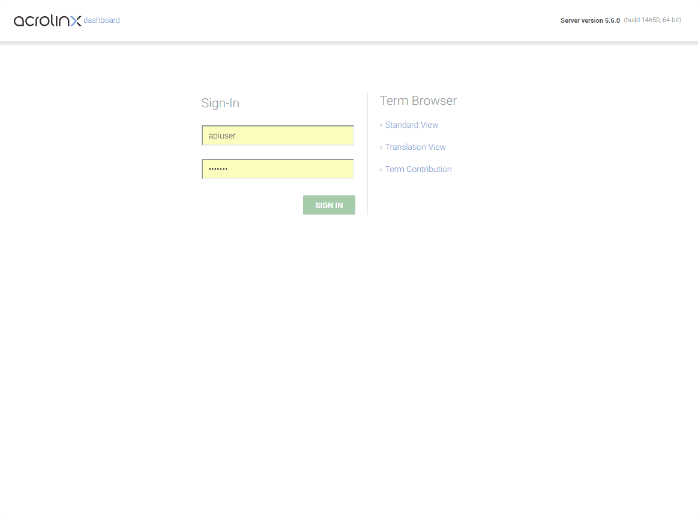
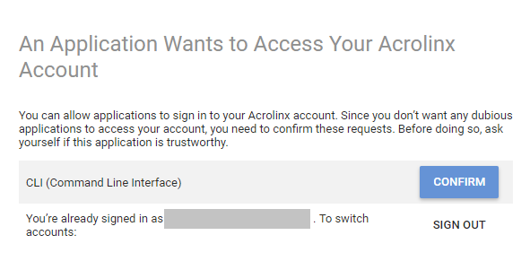

# (Beta) Acrolinx Command Line Interface (CLI)

This is a showcase for integrating the Command Line Interface into different systems.

See: [Getting Started with Custom Integrations](https://support.acrolinx.com/hc/en-us/articles/205687652-Getting-Started-with-Custom-Integrations)

## The Acrolinx Command Line Interface

The Acrolinx Command Line Interface is designed to:

* automate checks of your content in general,
* do quick and easy proof of concepts before you start implementing using one of our SDKs,
* integrating into systems that don't expose a proper API,
* integrating into programming languages where Acrolinx doesn't provide an SDK for,
* integrating into shell scripts, and
* integrating into editors and IDEs, where Acrolinx doesn't provide a native integration.

## Prerequisites

Acrolinx Platform version 2018.12 or newer.

Please contact [Acrolinx SDK support](https://github.com/acrolinx/acrolinx-coding-guidance/blob/master/topics/sdk-support.md)
for consulting and getting your integration certified.
  
Acrolinx offers different other SDKs, and examples for developing integrations.

Before you integrate the CLI in your process or infrastructure, you might benefit from looking into:

* [Getting Started with Custom Integrations](https://support.acrolinx.com/hc/en-us/articles/205687652-Getting-Started-with-Custom-Integrations),
* the [Guidance for the Development of Acrolinx Integrations](https://github.com/acrolinx/acrolinx-coding-guidance),
* the [Acrolinx SDKs](https://github.com/acrolinx?q=sdk), and
* the [Acrolinx Demo Projects](https://github.com/acrolinx?q=demo).

Make yourself familiar with [How Acrolinx Reads Your Content](https://github.com/acrolinx/acrolinx-coding-guidance/blob/master/topics/text-extraction.md).

Know your command shell. Different operating systems, or shells require different escaping of commands, files, and file patterns.
On linux, shells typically a single quote does the job (`'`). On Windows systems, you should use a double quote (`"`).
For [interoperability](https://github.com/acrolinx/acrolinx-coding-guidance/blob/master/topics/interoperability.md#interoperability),
we recommend using `/` as file separator, even if `\` will work on windows.

## Security

In most operating systems, other users can at least see the list of running processes including command line.
It might be a security breach, if you specify an access token, or other sensitive information via command line.
The CLI provides two mechanisms to prevent this:

* all command-line arguments can be set as [environment variables](#environment-variables), and
* you can create a JSON-based config file. The CLI can help you generating this file using the parameter `--save-json`.
  Make sure that the file permissions are set carefully.

Keep in mind that all commands might be stored in the command history (for example `.bash_history` in your home directory).
Depending on your environment most secure is either setting an environment variable,
or storing the token to a config file and use the parameter `--config`.

## Environment Variables

All command-line arguments can be set as prefixed environment variables. The prefix is `ACROLINX_`.

*Note:* since the parameter `--acrolinx-url` already includes `acrolinx`, it will double: `ACROLINX_ACROLINX_URL`

See: [Configure Environment Variables](doc/env.md)

## Getting an API Token

Getting an API Token is easy:

* Sign in to the Acrolinx Dashboard
* Click on `Settings` on the top
* Scroll down
* Click on `CREATE API TOKEN`
* Copy the API token. You can revisit this site later to get your token again.



## Run Locally

*Note:* The command might include a version number, and platform like: `acrolinx-cli-1.0.0.0.windows-x64.exe`.
To simplify the documentation, the CLI command will be called `acrolinx-cli` in all examples.

We assume that you've specified the [environment variables](#environment-variables) `ACROLINX_ACROLINX_URL`, and `ACROLINX_ACCESS_TOKEN`.
If not, the CLI will ask you for specifying the parameters:

* `--acrolinx-url=YOUR_ACROLINX_URL`, and
* `--access-token=`, or will automatically forward you to the [interactive sign-in](#signin).

If you specify the convenient parameter `--open`,
the CLI will automatically launch the default browser for sign-in, as well as the results in the Content Analysis dashboard.
Don't forget to remove the `--open` parameter once you run the CLI on a build system ;-).

### Convenient Usage / Reoccurring Checks

We recommend storing the access token and the Acrolinx URL to environment variables.
For many build systems addons exist, that make the usage even more secure.
Once you figured out the correct command line for your [use case](#use-cases),
save all arguments to a file using the parameter `--save-json=FILE_NAME`.

That file can be stored with your files to rerun a check.

To load a configuration specify `--config=FILE_NAME`.

#### Example

##### Save

Run a check on all mark down files, and save the configuration to [`.cli-config.json`](.cli-config.json):

```bash
acrolinx-cli check --files="*.md" --guidance-profile=b8ac6a9f-cadc-44f1-b41c-e60155173096 --result-json=results/result.json --result-junit=results/xunit.xml --save-json=.cli-config.json
```

##### Load

Load the configuration from [`.cli-config.json`](.cli-config.json) and run the check:

```bash
acrolinx-cli check --config=".cli-config.json"
```

### General Usage

```bash
acrolinx-cli COMMAND --PARAMETER1=VALUE1 --PARAMETER2=VALUE2 ...
```

To get an overview of the available commands, call:

```bash
acrolinx-cli -h
```

Each command like `info`, `check`, and so on, will have parameters.
To view the list of parameters, call:

```bash
acrolinx-cli COMMAND -h
```

Example:

```bash
acrolinx-cli check -h
```

### `info`

Test the connection, see version number, and get a list of available Scorecard locales:

```bash
acrolinx-cli info
```

```text
{
  "server": {
    "name": "Acrolinx Core Platform",
    "version": "2018.12.14904"
  },
  "locales": [
    "en",
    "de",
    ...
  ]
}
```

### `capabilities`

By default the CLI and the Acrolinx Platform try to guess the right options.
Sometimes you need to be more specific.
The `capabilities`-command will show the capabilities.
For most sections of the capabilities, you'll find a corresponding parameter of the CLI.

```bash
acrolinx-cli capabilities
```

```text
You're signed in as "baseline-cli".

GUIDANCE PROFILE:
-----------------
3cceed58-9682-4644-9846-8aee9686456f (de-Acrolinx Essentials General)
f0e02a7e-6b5b-4dc2-8bf5-2c0ae84e09e4 (en-Acrolinx Essentials General US)

CONTENT FORMATS:
----------------
TEXT
XML
HTML
PDF
JSON
PROPERTIES
JAVA
CPP
MS_OFFICE
MARKDOWN
AUTO

CHECK TYPES:
------------
batch
interactive

REPORT TYPES:
-------------
scorecard

...
```

*Note:* The capabilities differ between different Acrolinx Core Platform instances.

### `check`

*See:* `acrolinx-cli check -h` for more options.

#### Files

```bash
acrolinx-cli check --files="*.md"
```

```text
Batch ID: gen.cli.12fd8ea0-2a2e-11e9-af6c-718c6a9a59b0
You're signed in as "baseline-cli".
Check completed for: C:\github\cli-demo\README.md
Find the Content Analysis Dashboard here:
https://company.acrolinx.cloud/api/batch/gen.cli.12fd8ea0-2a2e-11e9-af6c-718c6a9a59b0
```

#### Websites

```bash
acrolinx-cli check --urls="https://www.acrolinx.com" --max-depth=2
```

### `signin`

The command `acrolinx-cli signin` can be used to obtain an Acrolinx access token.

The token can be used later on to authenticate with the CLI using `--token`.

#### Example

```bash
acrolinx-cli signin
```

```text
Please sign in using the following Acrolinx URL:
https://company.acrolinx.cloud/signin/integration/8a3f0f1e-749c-492f-bf24-90ba7f09de8a/confirm
```

The CLI will wait until the page was:

* opened in a browser,
* a user signed in, and
* confirmed the access.



```text
You can optionally use the following token to sign in:

JOIJAWEOP.ASDARDWERWERDF.SFDFSDF

You're signed in as "baseline-cli".
```

#### Interactive Sign-In on a Build System

To authenticate a build for testing the CLI configuration,
you can easily assign the output of it to an environment variable:

```bash
ACROLINX_ACCESS_TOKEN=$(acrolinx-cli signin)
```

You can sign in and confirm that on your development computer.
Once you granted access, the build computer will resume the job.

For production, use an [API token](#getting-an-api-token).

## Guidance Profile Selection

You can tell the CLI to use a Guidance Profile by specifying the parameter `--guidance-profile`.
Supported values for your user can be figured out by calling the [`capabilities` command](#capabilities).

In general, it's a good idea to not specify the Guidance Profile when calling the CLI.
The better approach is to configure a [profile assignment in the Acrolinx Dashboard](https://docs.acrolinx.com/coreplatform/latest/en/guidance/checking-profiles/create-and-configure-checking-profiles/checking-profile-assignments).

## Use Cases

### Integrate Into a Build System

* Jenkins (Will be documented soon)
* Maven (Will be documented soon)
* Gradle (Will be documented soon)
* [NPM](usecases/npm.md)
* Other Systems (Will be documented soon)

### Integrate Into a Version Control System

Note: If you're using GitHub, you might want to use the Acrolinx GitHub integration.

* Git Pre-Commit Hook (Will be documented soon)
* Other Systems (Will be documented soon)

## CLI Features

### Access

* Getting an access token using [interactive sign-in](#signin).
* Using an [API token](#getting-an-api-token).
* Proxy support

### Checking

* [Checking](#check) of local files.
* [Website checking](#check)
* ANT-Path-style file patterns:
    + `**` for multiple directories,
    + `*` as wild card.
* Check all file types that are [supported by the Acrolinx Platform](#capabilities).
* Filter all files that aren't natively supported by the platform.
* Specify a Guidance Profile.

### Performance

* Execute checks concurrently
  (*Note:* limited by number of [Acrolinx Language Servers](https://docs.acrolinx.com/coreplatform/latest/en/acrolinx-on-premise-only/get-started-with-the-core-platform/overview-of-the-acrolinx-servers)).

### Automation

* All options can be set as:
    + Environment variables,
    + Config file, and
    + Command-line parameter.
* Silent/JSON output for further processing
* Submit files with a different document reference
* Set a dedicated batch ID, to join multiple runs to one Content Analysis dashboard.
* Specify the type of a check.
* Authenticated links for interactive usage, unauthenticated links for storing in databases.

### User Experience

* Open URLs automatically in the default browser.
* Overwriting of options (environment variable, config file, command-line parameter).

### Results Processing

* Showing results in a Content Analysis dashboard.
* Create a JSON-based result file.
* Create a XUnit style result file for processing in build environments.
* Create a compiler style output for embedding into IDEs, that don't have a native Acrolinx Integration.

## References

* The CLI is based on the [Acrolinx Platform API](https://github.com/acrolinx/platform-api).
  Some of the API responses are directly returned by the CLI.

## License

Copyright 2019-present Acrolinx GmbH

Licensed under the Apache License, Version 2.0 (the "License");
you may not use this file except in compliance with the License.
You may obtain a copy of the License at:

[http://www.apache.org/licenses/LICENSE-2.0](http://www.apache.org/licenses/LICENSE-2.0)

Unless required by applicable law or agreed to in writing, software
distributed under the License is distributed on an "AS IS" BASIS,
WITHOUT WARRANTIES OR CONDITIONS OF ANY KIND, either express or implied.
See the License for the specific language governing permissions and
limitations under the License.

For more information visit: [https://www.acrolinx.com](https://www.acrolinx.com)