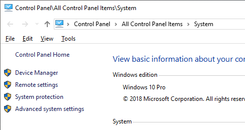
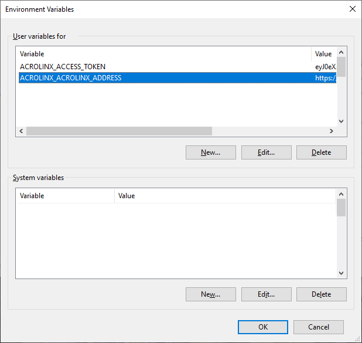
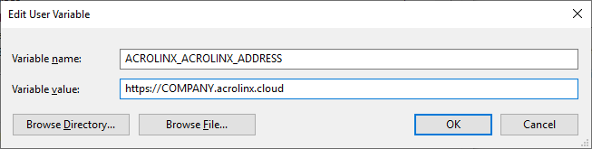

# Configure Environment Variables

## Windows

```batch
set VARIABLE=value
```

Alternatively, you can also specify the environment variable user or system wide:

* Goto `Control Panel\All Control Panel Items\System`:
  
  
* Open `Advanced system settings`:
  
  
* Click `New...` in either user or system variables, and enter the values:
  
  
* You have to restart the command window to make the changes effective.

### Example

```batch
set ACROLINX_ACCESS_TOKEN=JOIJAWEOP.ASDARDWERWERDF.SFDFSDF
set ACROLINX_ACROLINX_URL=http://COMPANY.acrolinx.cloud
```

## Linux and macOS

```bash
VARIABLE=value
```

### Example

```bash
ACROLINX_ACCESS_TOKEN=JOIJAWEOP.ASDARDWERWERDF.SFDFSDF
ACROLINX_ACROLINX_URL=https://COMPANY.acrolinx.cloud
```