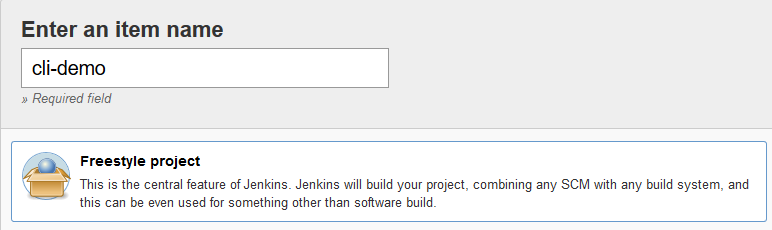
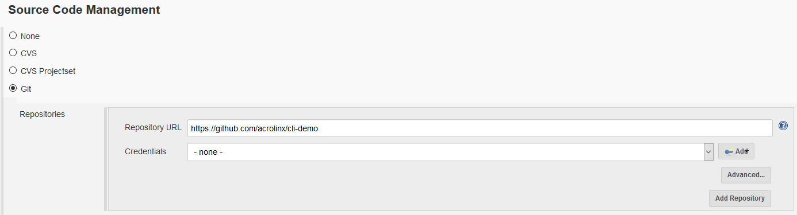
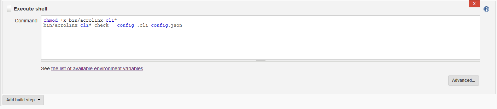
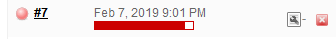
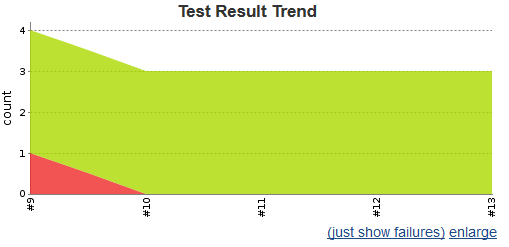
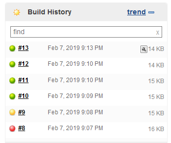

# Integrate the Acrolinx CLI in Jenkins

Make sure you're familiar with [how to configure and run of the CLI](../README.md).

We assume that your project already contains a CLI configuration file like [`.cli-config.json`](../.cli-config.json).

We also assume that the Jenkins slave runs on linux. If not, you might have to make some minor changes.

## Nothing to Configure?

* You've already some kind of build script like [NPM](npm.md) in place?
* The CLI in the build script is already configured to create XUnit reports?
* Your jenkins job already publishes XUnit files?
* You're done!

## How to Set Up a Job

* Set up a new Freestyle Jenkins job:

  

  
* Or modify an existing:

  

* Specify the repository you want to check:

  

* Configure the Access Token and the Acrolinx URL.
  Depending on security and your infrastructure, you can:

    + Use the `Mask Passwords Plugin`:

      

    + Set the [environment variables](../doc/env.md) on the slave, or
    + store the settings to the [CLI config file](../.cli-config.json).
* Make sure that the CLI is installed on the Jenkins slave.
  To be able to run the CLI, you might have to set the executable permission.

  ```bash
  chmod +x bin/acrolinx-cli*
  ```

* Add an `Execute shell` build step, that calls CLI with its config:

  ```bash
  bin/acrolinx-cli* check --config .cli-config.json
  ```

  
* Make sure that you installed the `JUnit Plugin`.
* Configure a post build action to publish the test results of `results/xunit.xml`.
  
  
* Save the job configuration.
* To run the job, click `Build Now`:
  
  
  
  
* To show a trend diagram, the publish test results post build action requires two, or more runs.
  Afterwards a diagram is shown:
  
  

* Jenkins will also show failing tests by in the build status:

  

For each checked file, one XUnit test case is created.
By default the CLI fails a test case, if the status is red, or yellow.
You can restrict the failing of the tests to red only by specifying the option `--fail-on-red`.

Jenkins can also be configured to fail the job, if tests fail.